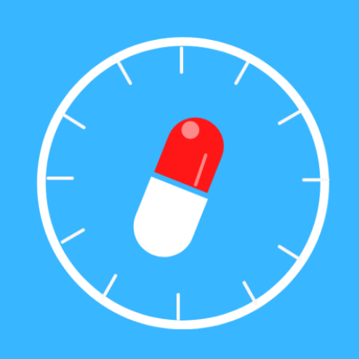
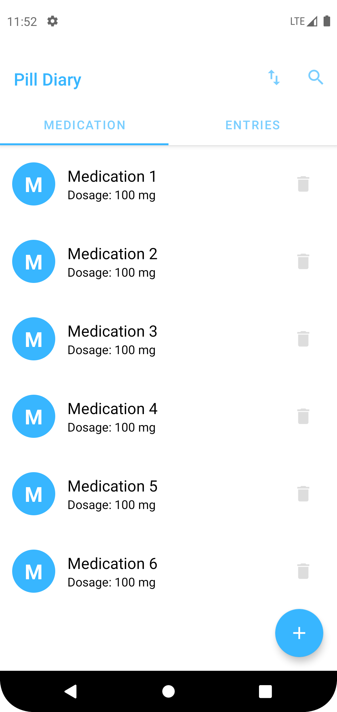
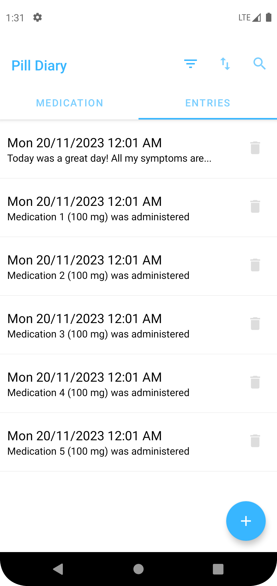

# Pill Diary - Medication Tracking App

Pill Diary is an open-source Android mobile application developed to assist users in keeping track of their medication. This application, written in Kotlin and XML, utilizes an SQLite database to enable users to store medication and journal entries offline, ensuring accessibility even without an internet connection.

## Features

- **Medication Tracking:** Record and manage your medications, including dosage and schedule.
- **Journal Entries:** Maintain a health diary by logging daily health activities and notes.
- **Offline Storage:** Implements SQLite database for secure offline storage of medication and journal data.

## Folder Structure

The project follows a structured organization within the `com.oaktech.pilldiary.tabs` package:

- **Controllers:** Contains controllers for SQLite database transactions and UI adapters.
- **Views:** Includes UI fragments used in the `MainActivity.kt`.
- **Models:** Holds data classes used throughout the application.

## Getting Started

1. Clone the repository: `git clone https://github.com/your-username/PillDiary.git`
2. Open the project in Android Studio.
3. Build and run the application on your Android device or emulator.

## Contribution Guidelines

Please read our [Contribution Guidelines](CONTRIBUTING.md) before contributing to the project. We appreciate bug reports, feature requests, and contributions from the community.

## Screenshots

You can add/view a list of your medications, as well as dosages. If you tap on a medication in the list, an autogenerated note will be added to the database showing that that medication was administered at the moment of the tap.

   &nbsp
  

## License

This project is licensed under the MIT License - see the [LICENSE](LICENSE.md) file for details.
